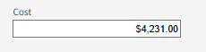
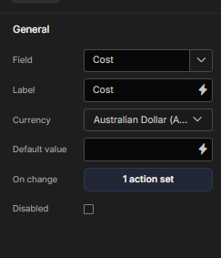

# Budibase Dynamic Currency Input

A flexible and dynamic currency input component for Budibase applications. This plugin allows users to input monetary values that are automatically formatted for a selected currency, while storing the underlying data as a clean number.

This component was developed to provide a much-needed, user-friendly way to handle various world currencies within Budibase forms.
- Component:

- Settings:

## Features

-   **Dynamic Currency Selection**: Choose from a list of 20+ major world currencies (USD, EUR, BRL, JPY, etc.) directly in the Budibase builder.
-   **Automatic Formatting**: The input field automatically formats the number on blur, displaying the correct currency symbol and decimal/thousand separators based on the selected currency's locale.
-   **Clean Data Storage**: While the display is formatted as a string (e.g., `A$1,234.50`), the value is saved to your data source as a standard `number`, making it easy to perform calculations and aggregations.
-   **`On Change` Event**: Fully integrated with the Budibase actions panel, allowing you to trigger automations, queries, or other actions whenever the value is updated.
-   **Customizable Styling**: Includes style settings for Width, Height, and Margin to perfectly match your application's design.
-   **Form Integration**: Works seamlessly within Budibase forms, correctly displaying initial values when editing existing records.

## Installation

1.  Go to the [Releases page](https://github.com/MarceloArraes/budibase-currency-input/releases) of your GitHub repository.
2.  Download the latest `budibase-currency-input-[version].tar.gz` file.
3.  In your Budibase builder, navigate to the **Admin** section (`/portal`).
4.  Go to **Plugins** and click the **Add Plugin** button.
5.  Upload the `.tar.gz` file you just downloaded.
6.  Your new "Currency Input" component will now be available in the component tray in the Design section of your apps.

## Usage

Once installed, using the component is straightforward:

1.  In the Budibase app builder, add a **Form** component and connect it to a data source.
2.  Click **Add Component** inside the form and search for **Currency Input**.
3.  Configure the component's settings in the right-hand panel:
    *   **Field**: Bind the component to a `Number` column in your table. This is where the value will be saved.
    *   **Label**: Set the text that appears above the input field.
    *   **Currency**: Select the desired currency from the dropdown menu. This controls the display formatting.
    *   **On change**: (Optional) Add actions that should run when the user changes the value in the input. The current numerical value is available as a binding.
4.  Switch to the **Styles** tab to adjust the component's `Width`, `Height`, and `Margin`.

## Author & Credits

This plugin was created by:

-   **Marcelo Arraes**
    -   GitHub: [https://github.com/MarceloArraes](https://github.com/MarceloArraes)

This project is supported by **Accede**, delivering innovative solutions and services.
-   Website: [https://www.accede.com.au/en](https://www.accede.com.au/en)

## License

This project is licensed under the **MIT License**.